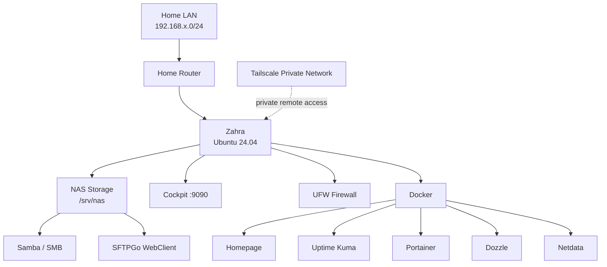

# Zahra Homelab

A hands-on learning environment for Linux, NAS, Infrastructure, DevOps/SRE, security, and AI-assisted automation.

## Overview
Zahra is an Ubuntu-based homelab built from an older laptop. It began as a learning NAS and is evolving into a practical infrastructure laboratory.

Current capabilities:
- Linux administration
- NAS / file sharing
- Samba / SMB
- SFTPGo WebClient
- Cockpit
- Tailscale private remote access
- UFW host firewall
- Docker/container operations
- Monitoring/dashboard applications
- Identity and filesystem permissions
- TOTP 2FA
- Infrastructure documentation

## Architecture


## Current services

| Service | Purpose | Port | Status |
|---|---|---:|---|
| Samba | SMB file sharing | 445 | Active |
| SSH | Remote administration | 22 | Active |
| Cockpit | Server management | 9090 | Active |
| SFTPGo | Web file management | 8080 | Active |
| SFTPGo SFTP | SFTP protocol | 2022 | Listening; not intentionally opened in UFW |
| Homepage | Service dashboard | 3000 | Docker troubleshooting deferred |
| Uptime Kuma | Monitoring | 3001 | Docker troubleshooting deferred |
| Portainer | Docker management | 9000 | Docker troubleshooting deferred |
| Dozzle | Docker log viewer | 8888 | Docker troubleshooting deferred |
| Netdata | Monitoring | 19999 | Docker troubleshooting deferred |

## NAS layout
```text
/srv/nas/
├── Public/
├── Documents/
├── Media/
└── Backup/
```

The current storage is the internal 128 GB SSD. This is a learning environment; same-disk backups do not protect against disk failure.

## Security
- UFW defaults to deny incoming traffic.
- Services are restricted to trusted LAN/Tailscale sources.
- Samba guest access is disabled.
- NAS filesystem access uses Linux owner/group permissions.
- `nasusers` is the shared NAS group.
- SFTPGo `nasuser` has TOTP 2FA enabled.
- No intentional public port forwarding is used.
- Secrets are never committed to Git.

## Privacy
This public repository intentionally excludes passwords, TOTP secrets/recovery codes, API keys, private keys, router credentials, and private identifiers. Use placeholders such as `<ZAHRA_LAN_IP>`.

## Roadmap
1. NAS Security & Identity — completed
2. NAS GUI — completed
3. Secure remote access — completed
4. SFTPGo 2FA — completed
5. Backup — next
6. DHCP reservation
7. Monitoring
8. AI + Automation Journey
9. Optional Nextcloud

## AI + Automation Journey
The next stage turns the homelab into a practical automation laboratory.

### Project 01 — Linux Server Health Checker
Planned checks:
- CPU
- memory
- disk
- uptime
- load average
- network reachability
- service status
- JSON/CSV reports

The objective is not merely to generate code with AI. The objective is to understand, test, validate, document, and operate the resulting automation.
